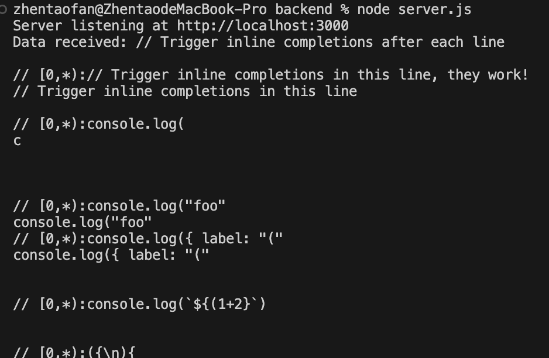
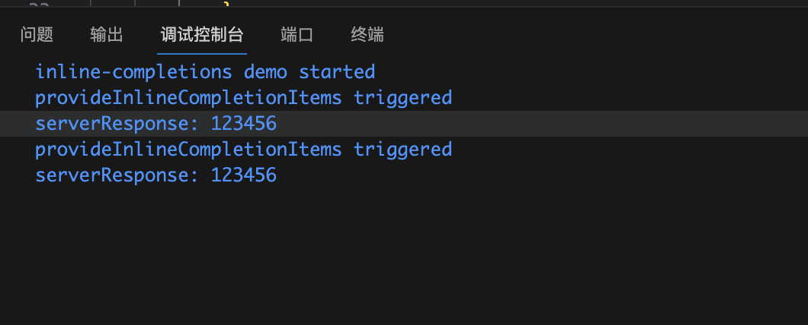
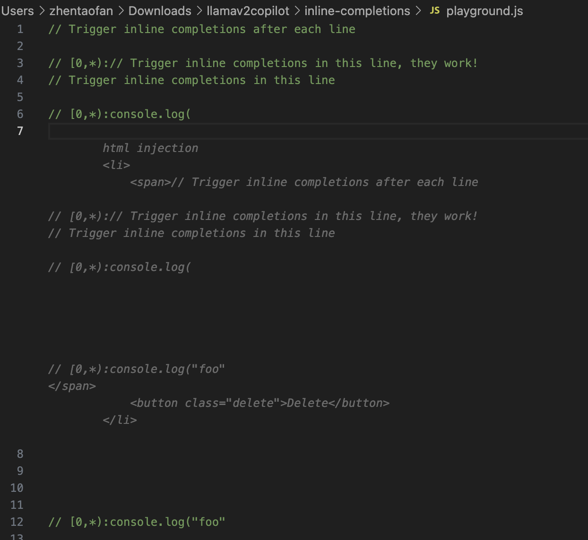

**./backend** is the local server with port 3000.

**./inline-completions** is the development for the extension.

## Console Logs in Server
Document text sent by IDE received by server.

## Response From Server Received in IDE

## Inline Completion in Copilot Style

### Security & Warning: 
We may need to sanitize the content sent to server to avoid injection.

*e.g.* Prompt Injection, Code Injection, SQL injection, Command injection, Markdown injection.
